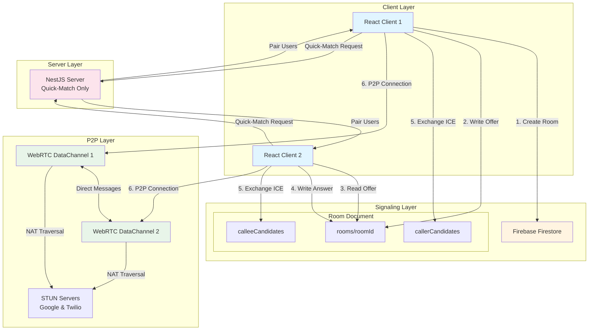
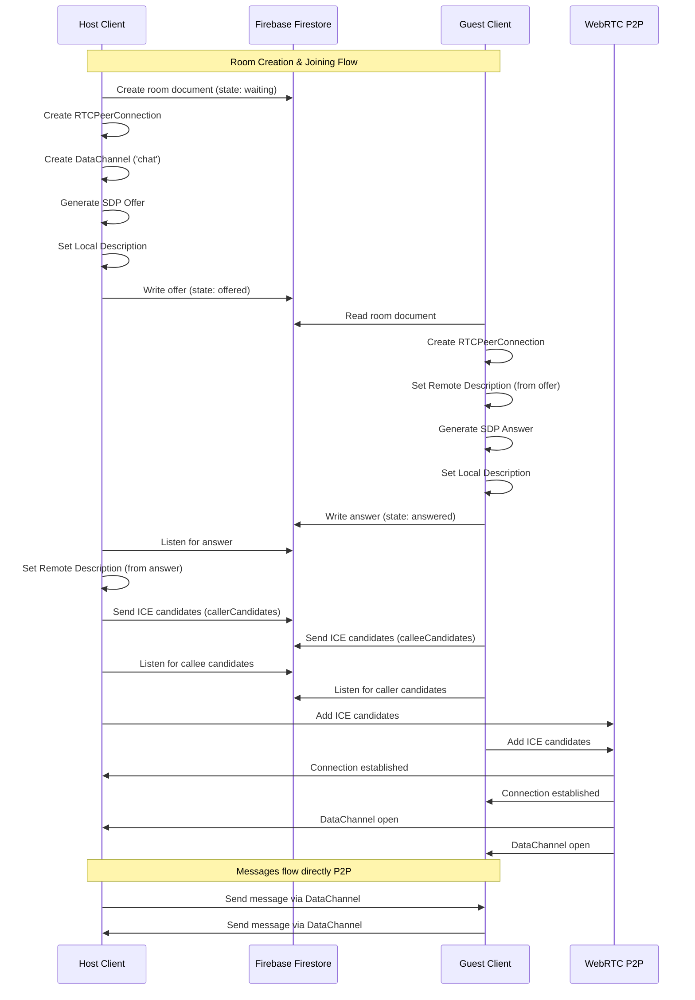
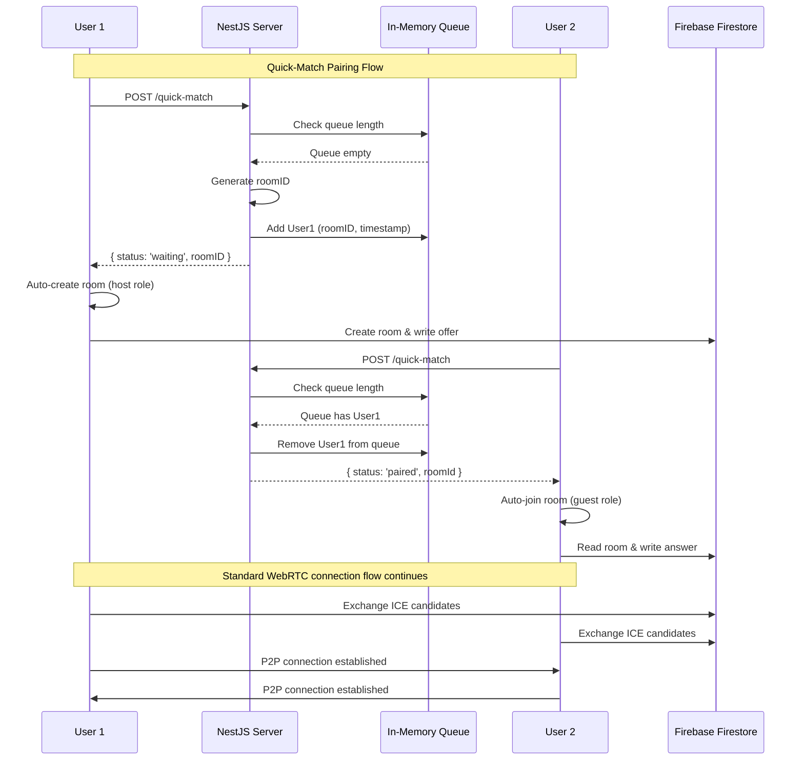
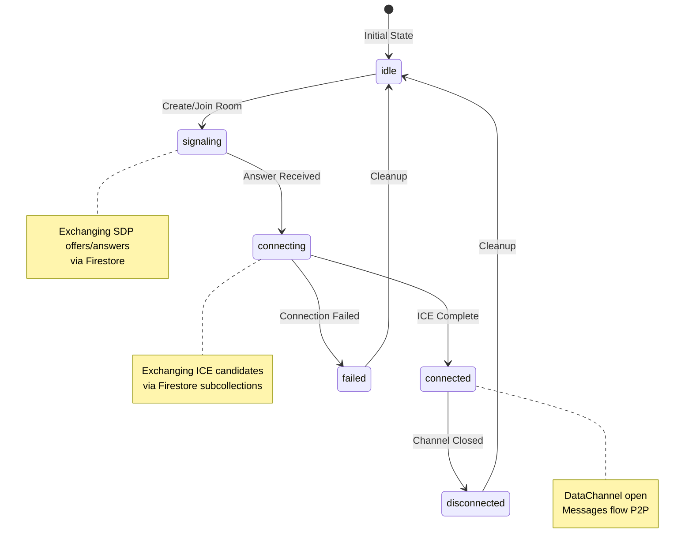
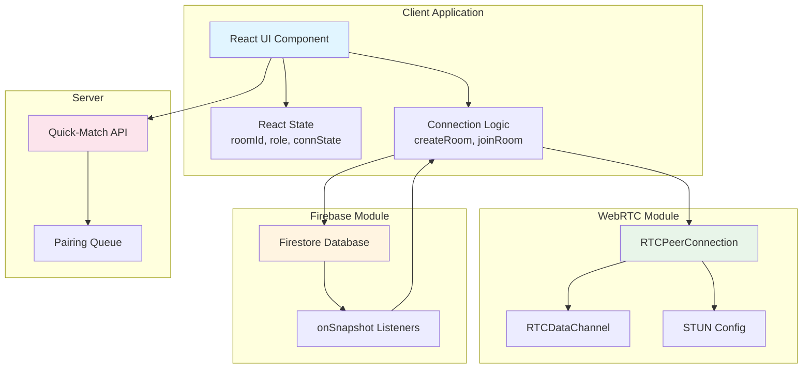
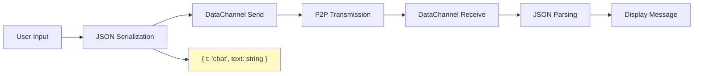
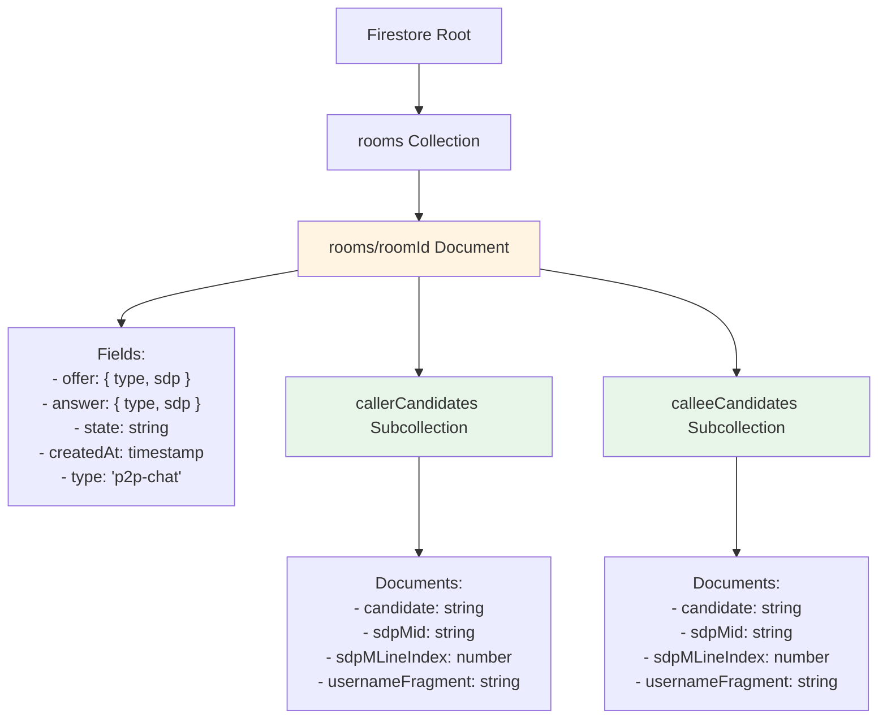

# Architecture Diagrams

## System Architecture Overview

## Room Creation Flow Sequence Diagram

## Quick-Match Flow Sequence Diagram

## Data Flow Diagram

```mermaid
flowchart LR
    subgraph "Signaling Phase"
        A[Host Creates Room] --> B[Write Offer to Firestore]
        B --> C[Guest Reads Offer]
        C --> D[Write Answer to Firestore]
        D --> E[Exchange ICE Candidates]
    end

    subgraph "Connection Phase"
        E --> F[WebRTC Connection Established]
        F --> G[DataChannel Opens]
    end

    subgraph "Messaging Phase"
        G --> H[Host Sends Message]
        H --> I[Message via DataChannel]
        I --> J[Guest Receives Message]
        J --> K[Guest Sends Message]
        K --> L[Message via DataChannel]
        L --> H
    end

    style A fill:#e1f5ff
    style C fill:#e1f5ff
    style F fill:#e8f5e9
    style I fill:#e8f5e9
    style L fill:#e8f5e9
```

## Connection State Machine

## Component Interaction Diagram

## Message Protocol Structure

## Firestore Data Structure

